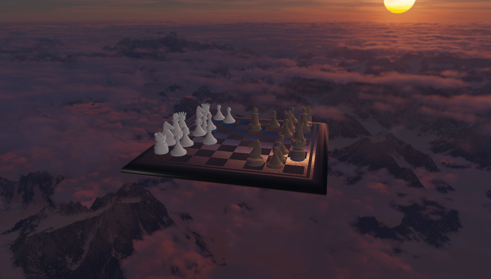
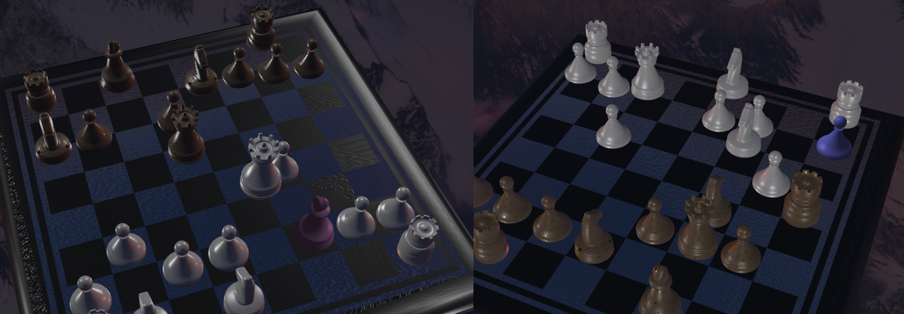

# 国际象棋自走棋 Auto-moving Chess Game
计算机图形学 小组项目 

[Video(bilibili)](https://www.bilibili.com/video/BV1EY411a7FE/)



棋子细节


吃子特效


## Abstract 
As we know, chess has complex forms and delicate textures, which can well reflect detailed light effect. Because the emphasis is openGL, not games. We decided to work on Auto-moving Chess Game project. We used many techniques including Jason to analysis gltf model, Cubemaps technique to make skybox, bloom technique, PBR shader with IBL, Gamma Correction and HDR technique. And we implemented an integrated and logical frame to control each chess piece, realized moving, rocking and beating other chess pieces with well-organized camera controlling and moving.

## Team member
[1952114 荆宇泉](https://github.com/github-jyq)
[1950084 陈泓仰](https://github.com/watermellye)
1952112 赵颂霖
1952106 赵艺博
1952547 孔艺菲
1853047 孔庆晨


## how to run this project:
```
下载Visual Studio (本项目开发环境为vs2019)
下载vcpkg：https://github.com/microsoft/vcpkg
运行vcpkg根目录的bootstrap-vcpkg
将本repo中的installed放入vcpkg根目录中
（实际上是在vcpkg\installed\x64-windows\中加入了glad和glfw等库）
vs打开vFinal文件夹下的sln文件，F5运行项目（Debug x64）
若失败，在vcpkg根目录以管理员权限运行cmd或powershell；输入 vcpkg integrate install
```

## The Scope of the project 
- Use Ray-Tracing technique to make the scenes more vivid.
- Add the chess AI to play chess with players automatically.
- Add friendly camera control. All control can be done by one mouse/touchpad/touchscreen.
- Add smooth animations to the chess when interacting and floating effect when it's still.

## Involved CG techniques 
- Skybox —— remote background that won’t translate with the camera.
- HDR —— Show details even if the scene is too bright or too dark
- PBR —— Using physical based render principle to render liver scenes.
- IBL —— collect lights from images to make chess pieces reflect the light of Skybox.

## References 
> [LearnOpenGL CN](https://learnopengl-cn.github.io/)

## Roles in group
-	All of us contributed for model choosing and making, especially 赵艺博 contributed hardest work. What’s more, she used Jason to analysis gltf model and load the model into the project.
-	荆宇泉 choose and wrote the skybox. And he with 孔庆晨,赵艺博 were responsible and HDR.
-	陈泓仰 made the frame of the project, realized moving, rocking and beating other chess pieces with well-organized camera controlling and moving.
-	赵颂霖 generated special effects of beating other chess pieces. First, he tried particle system. But the effect is not good enough, he bring about bloom effect.
-	孔艺菲 and 孔庆晨 brought out pbr technique and added Gamma Correction and IBL, using the results of HDR to achieve better effect.
-	What’s more, 孔艺菲 tried to add shadow, but the results looked odd as the chess pieces are rocking. So the shadow is not added in the final project.
-	Last,孔庆晨,赵艺博,陈泓仰 made great effort in merging codes.
