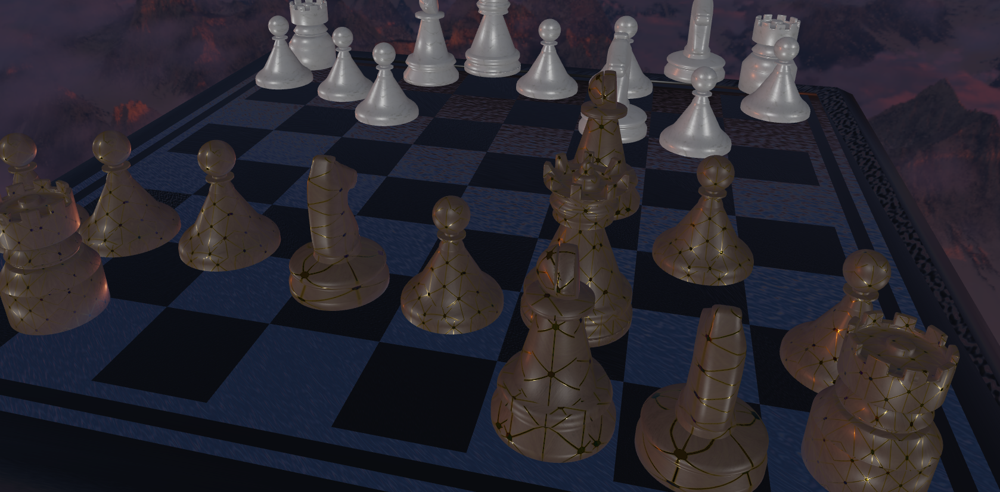

# 国际象棋自走棋 Auto-moving Chess Game
计算机图形学 小组项目 

[Video(bilibili)](https://www.bilibili.com/video/BV1EY411a7FE/)


棋子细节


吃子特效


## how to run this project:
```
下载Visual Studio (本项目开发环境为vs2019)
下载vcpkg：https://github.com/microsoft/vcpkg
运行vcpkg根目录的bootstrap-vcpkg
将本repo中的installed放入vcpkg根目录中
（实际上是在vcpkg\installed\x64-windows\中加入了glad和glfw等库）
vs打开vFinal文件夹下的sln文件，F5运行项目（Debug x64）
若失败，在vcpkg根目录以管理员权限运行cmd或powershell；输入 vcpkg integrate install
```

## The Scope of the project 
- Use Ray-Tracing technique to make the scenes more vivid.
- Add the chess AI to play chess with players automatically.
- Add friendly camera control. All control can be done by one mouse/touchpad/touchscreen.
- Add smooth animations to the chess when interacting and floating effect when it's still.

## Involved CG techniques 
- Skybox —— remote background that won’t translate with the camera.
- HDR —— Show details even if the scene is too bright or too dark
- PBR —— Using physical based render principle to render liver scenes.
- IBL —— collect lights from images to make chess pieces reflect the light of Skybox.

## References 
> [LearnOpenGL CN](https://learnopengl-cn.github.io/)

